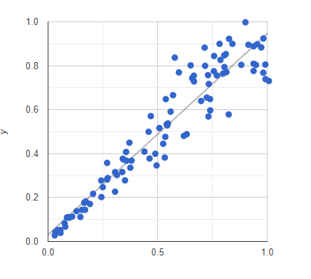
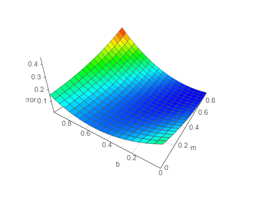

# Simple linear regression model with gradient 3dGraph

This is a simple model, that tries to approximate the function y = m * x + b. 
For the slope(m) I choosed 1 and the y-intercept(b) is 0. Under Visualisation you can find some sample datapoints, and the guessed function at the left, that updates in real-time. At the right is the gradient landscape where try to go to the dark blue area where m is 1 and b is 0.

## About this repo

This repository contains the logic and scripts that combine
three packages:
- [TensorFlow.js](https://github.com/tensorflow/tfjs), libary to process neural network operations in JavaScript
- [visjs.org](http://visjs.org/), a libary to show 3dGraphs
- [Babeljs.io](https://babeljs.io/), an extention to use next generation JavaScript
- [Parcel Bundler](https://github.com/parcel-bundler/parcel), Blazing fast, zero configuration web application bundler
- [Google Charts](https://developers.google.com/chart/interactive/docs/quick_start), Display live data on your site

## Gallery

Visualisation of the function we want to approximate:

Visualisation of the gradient Landscape:

### Install

1. Download the project
2. Call 'npm install' in your projectfolder(Make sure npm is installed)
3. 'npm run build'
4. 'npm run watch'
5. If your browser doesn't open by itself navigate to 'http://localhost:1234/'